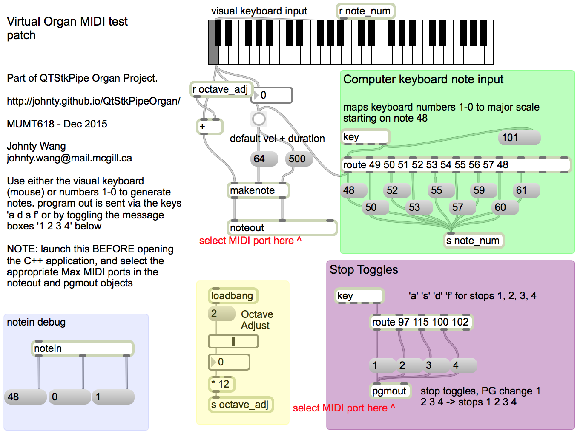

# A Realtime Pipe Organ Instrument using QT and STK

Johnty Wang (johnty.wang@mail.mcgill.ca)

Project Report for MUMT618, Fall 2015. 

Instructor: Prof. Gary Scavone

##Introduction

* This project report describes the implementation of a pipe organ instrument in C++ using the STK, RtAudio and QT libraries. 

* The goal is a cross-platform C++ GUI application that simulates basic types of common organ pipes, the: flue and reed.

* The instrument appears as a virtual MIDI device that can be controlled by hardware controllers: note-on/off messages control pitches while program changes allow toggling of stops. 

* Using a single MIDI keyboard, the behaviour of a small chamber organ can be simulated. 

* The rest of the report consists of the following sections: 
	1. An introduction and background on the physical layout and relevant parts of a pipe organ. 
	2. A discussion on how various parts of the organ may be modelled.
	3. Implementation details of the C++ application and a description of the available demonstration so far.

 
The organ at Ryerson United Church, Vancouver BC. (photo: Johnty Wang)

---
##Background

* Despite having a chromatic keyboard, the organ is a wind instrument and very different to most keyboard instruments. (Exceptions include the piano accordion and melodica)

* Unlike other wind instruments, the air is not supplied by the player directly. Traditionally created using manual bellows; nowadays digital blowers. The following image shows a "treadmill" that is typical of old church organs before steam or electric blowers. Smaller organs had bellows that could be pumped by the knees of the player, or non-playing hand in the case of really small "regal organs" (Clarke).

 
(img src: wikipedia)

###Flue and Reed Pipes

There are two main kinds of pipes on an organ.

####Flue Pipes

* The flue pipe is somewhat similar in operation to a flute

 
(img src: Clarke/wikipedia)

	
* Frequency is tuned by length of pipe
* The metal pipes are mostly cylindrical/conical, while the wooden ones are rectangular in cross section. However, more exotic shapes exist:

 
(img src: Clarke)

####Reed Pipes
* The reed pipe is more like a clarinet (or very large single reed harmonica, perhaps). There is a small spring attached to the read that allows tuning of its fundamental frequency. The length of the pipe is tuned to this frequency.

	(Clarke 1877)

###Pipe Organization

* The pipes are grouped together in a row (called "stops" or "ranks"), and connected to the air source or "wind chest".

(Clarke 1877)

* If a stop is active, there is a mechanical (or electrical) link between the keyboard note, and the valve associated with a particular pipe.

* Stops that are "unique" to the instrument are called principles or diapason, while others often bear the names of instruments the stop is supposed to imitate. Mutation stops don't sound at the fundamental note, but instead some harmonic of the fundamental and is generally used in combination with other stops to reinforce partials of a sound. (e.g. for the "Cornet" stop, a base flute stop is combined with other stops tuned to the harmonic series).

* A large church organ can have thousands of pipes. (e.g. at St Andrews & St Paul, Montreal where we sing, there are around 7000 pipes)

###Adjusting the Sound

* Control of individual pipe by adjusting its physical parameters (Voicing)

* Choosing combinations of stops to be used (Registration). On mechanical systems it requires the manual selection and deselection of many controls, and often another person is employed for the task for complex setups. In electronic control systems with memory the task can be actuated using preset buttons.

###Control System/Inputs

* Keyboard: 6 octaves of chromatic notes,. Set of 3-6 depending on instrument. Referred to as manuals.

* Pedalboard: 1 ~ 3 octaves of chromatic notes, activated by the foot. Traditionally assigned to large, bass pipes.

* Stops: draw tabs that activate each set of pipes

* Foot switches: discrete buttons for activating settings, swell shutters that control volume by adjusting blinds in which certain pipes are housed. This usually applies to the "swell" and "choir" groups of stops.

* Couplers: these toggles allowed the input of one manual to control stops associated with another. For example, if one of the keyboard manuals is coupled to the pedalboard, pressing the keys would activate the notes of the stops normally associated with the pedals. They can also "couple" the action of other controllers such as the footpedals for swell and choir shutters (e.g. pressing one pedal can control both shutters, etc).

Traditionally, everything is linked mechanically (Tracker organs). This allowed more direct control of the lever mechanisms for controlling the flow/stop of air, but also requires larger input forces as more stops are active. Following is an image of the complex mechanical matrix of a tracker organ system.

Over time, as instruments got larger, pneumatic actuators, akin to "fly-by-wire" aircraft control systems, eliminated the limitation of the tracker action by decoupling the input at the keyboard with the actual stop mechanism controlling the airflow.

Most modern organs are digitally controlled. This allows more flexible coupling, and quick recall of complex combinations. This also means the console does not have to be located in fixed place. (For example, the Ryerson organ shown at the beginning of this document can be carted around the sancturary and wired to the control system via a network cable.

(Organ console at Holy Trinity, Buffalo. src: wikipedia. The round buttons on either side of the keyboards are the stop toggles. The two rows of vertical switches above the keyboard are the couplers. The round buttons between keyboard manuals are for loading combination presets. The two depressed foot pedals in the centre are the swell and choir shutter controllers for controlling the volume of those sets of stops, and the "crescendo" pedal allows stops to be incrementally activated as it is depressed further, creating increasingly louder and fuller sounds.)

####*The Organ is probably the world's first "synthesizer"*
In the sense that it allows one to re-map the inputs to create different outputs. It also "synthesized" various other instrument sounds by imitation, including the "Vox Humana" stop which is a reed stop has some similar characteristics to the human vocal tract.

####*Can "fully reproduce" a performance from recorded signals*
Since all the actions of the player on a modern organ is essentially translated to discrete control events, a system that records such actions will be able to "fully reproduce" a performance on the instrument. (This even includes any time-based quantization of the events, which would have been an inherient feature of the many digital control systems during a live performance). This is an interesting philosophical point on a control level. Perhaps, J.S. Bach was referring explicitly to the organ when saying the following:

&nbsp;&nbsp;&nbsp;*"It's easy to play any musical instrument: all you have to do is touch the right key at the right time and the instrument will play itself."*

---

## Components that may be of interest for Modelling

Some of the relevant parts to be modelled by an organ might include:

* Pipes: physical response of the different kinds of pipes (geometry, materials)

* Interaction between pipes (e.g. detuned sets of stops for tremolo effects)

* Imperfections due to environment conditions (e.g. temperature fluctuations)
 
* Air source: fluctuations in air pressure; physical limits of blowers, tracker actuation

* Reed behaviour

* Control system: coupling, mapping of manuals to different registers

* Reverberance of spaces

### Existing Commercial Products

One of the more famous virtual software organ systems is [Hauptwerk](https://www.hauptwerk.com/learn-more/overview/). It has an extensive sample-based library of many organs.

##Implementation

This section describes the implementation details of the application implemented for the project.

Development was done in QT, a cross platform C++ development environment

The main components of the software includes:

* User interface for basic control, visual feedback of status
* MIDI interface for reading input from external controller
* Synthesis module for producing sound, managing voices
	* STK Voicer class for managing polyphony
	* Updated every RtAudio tick() and fills output buffer
	* STK Instruments for different type of "pipes". To start off I inherited from existing classes so that existing functionality can be overridden to be closer to "organ-like" behaviour.
* Helper Max/MSP patch for testing without a physical MIDI device
	
The following shows a block diagram of the components of the system

###Synthesis: Organ Model

As described in the previous section, there are two main categories of organ pipes: the flue and the reed.

A first-pass attempt at putting something together, given the existing models in STK might look like:

Or, if we're looking at reed pipes:

####Flue Pipes

Since the flue pipe can be seen as a simplier version of a flute, for the implementation I have subclassed the basic flute model in STK with a class called "OrganFlue", and started experimenting with overriding the various internal functions to remove the flute-specific functionalities such as overblowing. (On-going)

####Reed Pipes

One significant difference between the clarinet and the reed pipes of the organ is that the latter's reeds are tuned to vibrate at the funamental frequency with the pipe length set to resonate around the same frequency, while the clarinet's reed vibrates at a higher frequency than the fundamental of the pitch. Therefore, a reasonable first attempt, given my current understanding of the implementation of the clarinet model in STK, would be to modify the Jet"Table" (not really a table) source to output to the fundamental frequency instead. (On-going)

---

###Framework and Realtime Audio/MIDI Considerations

* ASIO drivers were used (in the Windows version) for RtAudio DAC. On Mac the CoreAudio framework is included in the QT project while in Linux alsa is used. These system-dependent settings are configured using platform-specific switches inside the QT .pro project file, which allows the rest of the code base to be identical across systems.

* When there is no external MIDI controller, a virtual MIDI port can be created in RtMidi (OSX and Linux only).

* The Windows MIDI API does not allow for virtual MIDI input devices to be created, which means that if a physical MIDI device is not present, a software loopback MIDI driver (such as [loopMIDI](http://www.tobias-erichsen.de/software/loopmidi.html)), must be used. The RtMidi interface must then connect to the virtual loopMIDI port, and then the MIDI output source connected to the same port.

* Testing was done on a desktop PC system, PC Laptop, MacBook laptop, and a virtual ubuntu32 image running inside VirtualBox

* 512 buffer size was used. This means at 44100kHz sample rate, we need to compute the 512 samples every ~11ms (also the system latency). This will affect upper limit of polyphony

* A very crude sine wave test was done as a "stress test" and suggested there was enough "computational room" to play with.
	* ~500 waves on i5 Mobile CPU
	* ~900 waves on i5 Desktop CPU
* Actual synthesis is more computationally extensive, but this gives a good ballpark idea

###Demonstration

The program was tested and demonstrated using an [ION Discover](http://www.ionaudio.com/products/details/discover-keyboard-usb) mini USB keyboard. It is a simple device with two octaves of velocity sensitive keys. There are 4 additional buttons on the side. Two of them are for octave adjustment, one to activate the sustain pedal message and another modifier key that turn the main keys into increasing program change numbers.

 
[(img src: ION website)](http://www.ionaudio.com/products/details/discover-keyboard-usb)

A Max/MSP patch (included in the project repository) was created to provide MIDI signals when there is no external controller present. The patch allows connection to the virtual MIDI input port of the synthesizer application, and transmit note and program change messages.

 
Max/MSP text patch

###Further Development

* I have only started to play around with the overridden instrument classes, so further investigation for creating more "authentic" organ sounds should be done.

* Modelling other effects such as swell boxes, reverb of different spaces

* Use with more controllers, so multiple stops can be played concurrently on each controller

* Control with non-keyboard controllers

###References

D. Baker. The Organ : a Brief Guide to its Construction, History, Usage and Music. 1991.

W. H. Clarke. An Outline of the Structure of the Pipe Organ. Oliver Ditson & Co. Boston. 1877.

####Image Sources

* Images from Clarke (1877) are public domain.
* Images from wikipedia under Creative Commons usage
* Image of ION product directly linked to product site (assuming they don't mind the free promotion).

