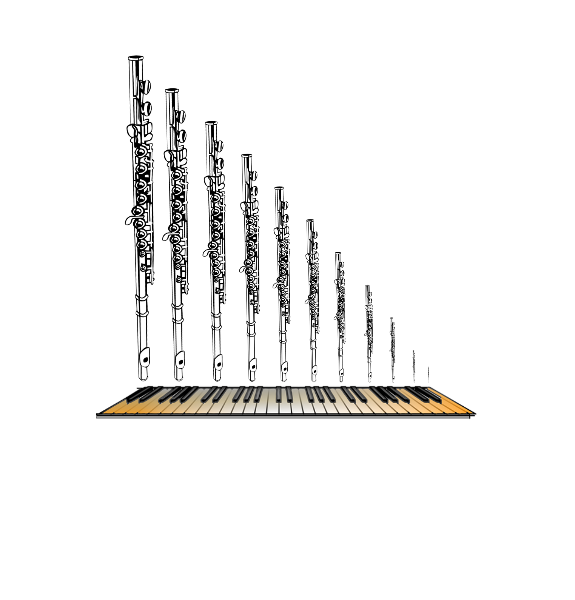

# A Realtime Pipe Organ Instrument using QT and STK

Johnty Wang (johnty.wang@mail.mcgill.ca)

Project Report for MUMT618, Fall 2015. 

Instructor: Prof. Gary Scavone

##Introduction

* This project report describes the implementation of a pipe organ instrument in C++ using the Stk, RtAudio and QT libraries. 

* The goal is a cross-platform C++ GUI application that simulates basic types of common organ pipes, the: flue and reed.

* The instrument appears as a virtual MIDI device that can be controlled by hardware controllers: note-on/off messages control pitches while program changes allow toggling of stops. 

* Using a single MIDI keyboard, the behaviour of a small chamber organ can be simulated. 

* The rest of the report consists of the following sections: 
	1. An introduction and background on the physical layout and relevant parts of a pipe organ. 
	2. A discussion on how various parts of the organ may be modelled.
	3. Implementation details of the C++ application so far.

	
	The organ at Ryerson United Church, Vancouver BC

---
##Background

* Despite having a chromatic keyboard, the organ is a wind instrument and very different to most keyboard instruments. (One other exception is the accordion!)

* Unlike other wind instruments, the air is not supplied by the player directly. Traditionally created using manual bellows; nowadays digital blowers.

(img src: wikipedia)

* Air is fed into banks of pipes that produce sound.

###Flue and Reed Pipes

There are two main kinds of pipes on an organ.

####Flue Pipes

* The flue pipe is somewhat similar in operation to a flute (or perhaps more appropriately, a recorder)

(Clarke 1877)
* Frequency is tuned by length of pipe
* Typically metal (usually cylindrical) or wood (often rectangular)

(Clarke 1877)

####Reed Pipes
* The reed pipe is more like a clarinet (or very large single reed harmonica, perhaps).

(Clarke 1877)

* The pipes are grouped together in a row (called "stops" or "ranks"), and connected to the air source or "wind chest".

(Clarke 1877)

* If a stop is active, there is a mechanical (or electrical) link between the keyboard note, and the valve associated with a particular pipe.

* Stops that are "unique" to the instrument are called principles, while others often bear the names of instruments the stop is supposed to imitate.

* A large church organ can have thousands of pipes. (e.g. St Andrews & St Paul, Montreal: ~7000 pipes!)

###Adjusting the Sound

* Control of individual pipe by adjusting its physical parameters (Voicing)

* Choosing combinations of stops to be used (Registration)

###Control System/Inputs

Keyboard: 6 octaves of chromatic notes,. Set of 3-6 depending on instrument. Referred to as manuals.

Pedalboard: 1 ~ 3 octaves of chromatic notes, activated by the foot. Traditionally assigned to large, bass pipes.

Stops: draw tabs that activate each set of pipes

Foot switches: discrete buttons for activating settings, swell shutters that control volume by adjusting blinds in which certain pipes are housed

Traditionally, everything is linked mechanically (Tracker organs).

Most modern organs are digitally controlled. Allows more flexible coupling, and quick recall of complex combinations.

(Organ console at Holy Trinity, Buffalo. src: wikipedia)

####*The Organ is probably the world's first "synthesizer"*

####*Can "fully reproduce" a performance from recorded signals*

## Components that may be of interest for Modelling

* Pipes: physical response of the different kinds of pipes (geometry, materials)

* Interaction between pipes (e.g. detuned sets of stops for tremolo effects)

* Imperfections due to environment conditions (e.g. temperature fluctuations)
 
* Air source: fluctuations in air pressure; physical limits of blowers, tracker actuation

* Control system: coupling, mapping of manuals to different registers

* Reverberance of spaces

## Commercial Products

One of the more famous virtual software organ systems is [Hauptwerk](https://www.hauptwerk.com/learn-more/overview/). It has an extensive sample-based library of many organs.

###Implementation

QT Application: cross platform C++ development environment

* User interface for basic control, visual feedback of status
* MIDI interface for 
* Synthesis module for producing sound, managing voices

###Synthesis: Organ Model

As described in the previous section, there are two main categories of organ pipes: the flue and the reed.

A first-pass attempt at putting something together, given the existing models in Stk might look like:

Or, if we're looking at reed pipes:

###Realtime Audio/MIDI Considerations

* ASIO drivers were used (in the Windows version) for RtAudio DAC

* 512 buffer size was used. This means at 44100kHz sample rate, we need to compute the 512 samples every ~11ms (also the system latency)

* Will affect upper limit of polyphony

* A very crude sine wave test was done as a "stress test":
	* ~500 waves on i5 Mobile CPU
	* ~900 waves on i5 Desktop CPU

* Actual synthesis is more computationally extensive, but this gives a good ballpark idea

* RtMIDI for MIDI Input. If using as a soft instrument, virtual inputs possible (OSX/Linux), loopMidi on Windows

###Demonstration

###Further Development

* Try modelling different pipe shapes, creating more groups of stops

* Modelling other effects such as swell boxes, reverb of different spaces

* Use with more controllers, so multiple stops can be played concurrently on each controller

* Control with non-keyboard controllers

###References

D. Baker. The Organ : a Brief Guide to its Construction, History, Usage and Music. 1991.

W. H. Clarke. An Outline of the Structure of the Pipe Organ. Oliver Ditson & Co. Boston. 1877.

