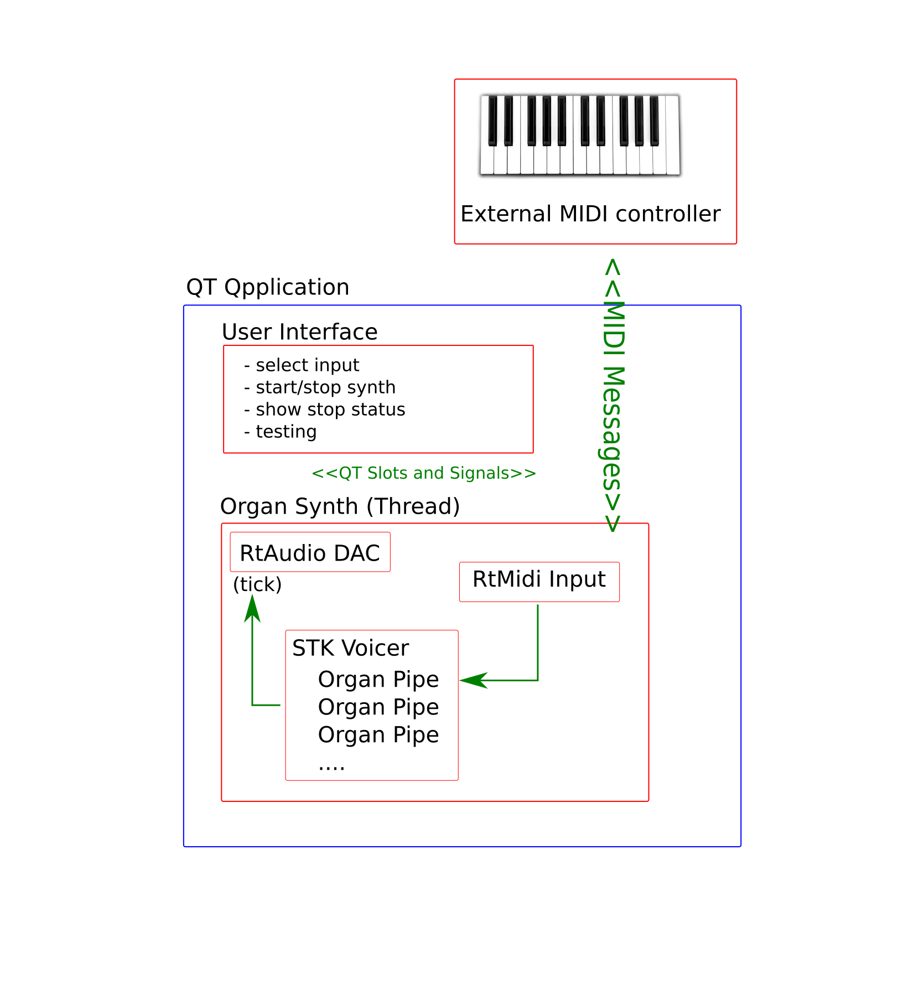

# A Realtime Pipe Organ Instrument using QT and STK

Johnty Wang (johnty.wang@mail.mcgill.ca)

Project Report for MUMT618, Fall 2015. 

Instructor: Prof. Gary Scavone

##Introduction

* This project report describes the implementation of a pipe organ instrument in C++ using the Stk, RtAudio and QT libraries. 

* The goal is a cross-platform C++ GUI application that simulates basic types of common organ pipes, the: flue and reed.
* The instrument appears as a virtual MIDI device that can be controlled by hardware controllers: note-on/off messages control pitches while program changes allow toggling of stops. 
* Using a single MIDI keyboard, the behavior of a small chamber organ can be simulated. 
* The rest of the report consists of the following sections: 
	1. An introduction and background on the physical layout and relevant parts of a pipe organ 
	2. A discussion on how various parts of the organ may be modelled
	3. Implementation details of the C++ application so far

The organ at Ryerson United Church, Vancouver BC

---
##Background

* Despite having a chromatic keyboard, the organ is very different to most keyboard instruments
* The pipe organ is a wind instrument, as opposed to string/percussion instruments that most other are. (One other exception is the accordion!)
* Unlike other wind instruments, the air is not supplied by the player directly. Traditionally created using manual bellows; nowadays digital blowers

(img src: wikipedia)
* Air is fed into banks of pipes that produce sound
* A large church organ can have thousands of pipes

###Flue and Reed Pipes

There are two main kinds of pipes on an organ.

* The flue pipe is somewhat similar in operation to a flute (or perhaps more appropriately, a recorder)

(img src: wikipedia/Clarke)

* The reed pipe is more like a clarinet:
* The pipes are grouped together in a row (called "stops" or "ranks")

(img src: Clarke 1877)

###Adjusting the Sound

* Control of individual pipe by adjusting its physical parameters (Voicing)
* Choosing combinations of stops to be used

* 

###Air Source

The rows of organ

###Combinations

###Control System/Inputs

Keyboard: 6 octaves of chromatic notes,. Set of 3-6 depending on instrument. Referred to as manuals.

Pedalboard: 1 ~ 3 octaves of chromatic notes, activated by foot

Stops: pull controls 

Foot switches: discrete buttons for activating settings, swell shutters that control

Traditionally, everything is linked mechanically (Tracker organs).

Most modern organs are digitally controlled. Electronic 

####*The Organ is probably the world's first "synthesizer"*

Some of the more obvious differences include the sound generation mechanism: the pipe organ functions more like a wind instrument (both reeded and open hole) rather than a string struck by a percussive hammer. 

Second, with exception to the swell box shutters that control the amount of sound that exits the enclosure housing the pipes, the volume produced by the instrument is mostly controlled by the number of active "stops", or groups called "registers" that are activated at the same time. This means that the amount of volume, and tone output is defined by the currently selected mixture of stops, rather than the velocity in which the key is played.

## Commercial Products

One of the more famous virtual software organ systems is [Hauptwerk](https://www.hauptwerk.com/learn-more/overview/). It has an extensive sample-based library of many organs.

###Implementation

Most of the development was performed on a Windows laptop with 8GB RAM and an Intel i7-4510u processor. The reason Windows was chosen was, based on prior experience, integrating such cross platform libraries tend to be the most difficult on this operating system, and hence having figured out how to set it up for this case, the rest should be considerably easier.

###Instrument Models

As described in the previous section, there are two main categories of organ pipes: the flue and the reed.

##Framework Overview
QT is ... Stk/RtAudio

##Library Integration

challenges (esp. windows)

##Realtime Audio Implementation

Virtual MIDI Control

###Performance Metrics
Very early in the implementation, as soon as the real time dac was integrated, I wanted to make sure there was enough processing power to handle a large number of voices. As a very crude first test, I attempted to compute a large number of sine waves. The number achieved without noticeable dropouts in the audio stream was somewhere between 512 and 800 simultaneous Stk Sine objects that were computed sample by sample (using a single .tick() command for each frame. As a comparison, the same code, when running on a desktop-class i5 system, ran without dropouts at around 900 objects. Of course, this is not a rigorous test by any means, but should provide a general ballpark figure.

###Discussion and Conclusion

loren ipsum

